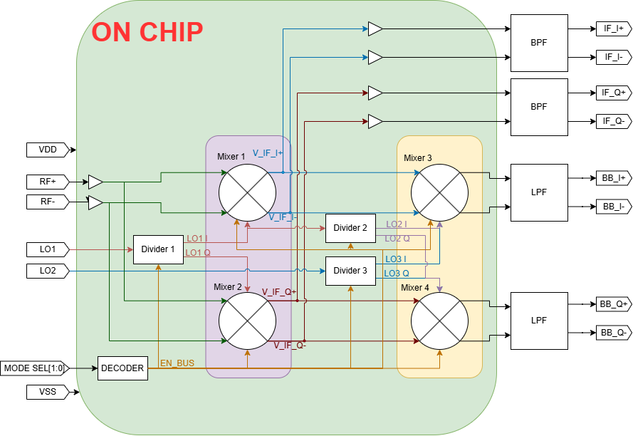

# NYCMOS Chipathon 2026

## Overview

Reconfigurable RF downconversion educational IC for visualizing and comparing receiver architectures.

The platform enables experimentation with:

- Homodyne (direct-conversion) receivers

- Heterodyne receivers

- Sliding IF

- Two-stage downconversion architectures

Observable RF, IF, and baseband nodes allow measurement using oscilloscopes, FFT analysis, and external filtering networks.

## Architecture

The platform consists of:

- Quadrature first-stage mixer pair (I/Q)
- Quadrature second-stage mixer pair (I/Q)
- On-chip LO divider for quadrature generation
- Exposed IF and baseband outputs
- External student-designed BPF/LPF networks

## Team
 | Member | Responsibilities |
 |--------|------------------|
 | Demian | Output buffer |
 | Lei | Divider design, mode select logic |
 | Charbel | Mixer design, input buffer |

## Current Status

### Completed
- Divider Schematic

### In Progress
- Divider Testbench
- Mixer schematic

### Upcoming
- Mixer testbench
- Input buffer design
- Mode select logic 
- Top-level integration

## Repository Structure

- `docs/` -  proposal materials, references, and meeting notes
- `designs/` - circuit blocks, including schematics, layouts, and testbenches
  - `mixer/`
  - `divider/`
  - `input_buffer/`
  - `output_buffer/`
  - `mode_decoder/`
  - `top_level/`

## Resources

### Project Links

- [Proposal Presentation](https://docs.google.com/presentation/d/1ySrDNINa8G7hdXDCi9I0f6ue9poP8fiGctQKzkyGpoE/edit?usp=sharing)
- [Task Tracker](https://docs.google.com/spreadsheets/d/1Od1J7DOz2SekQrFCoG0DU00RiTUWZIC1DUhUMYMRFoQ/edit?usp=sharing)
