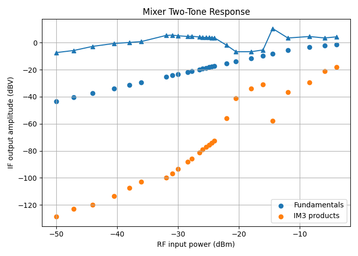
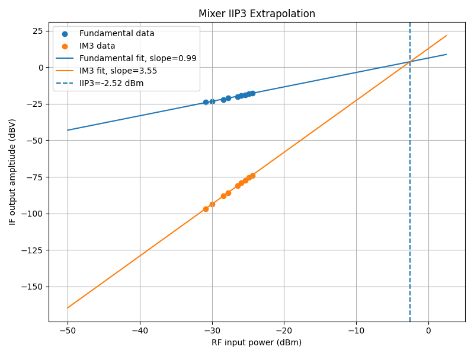
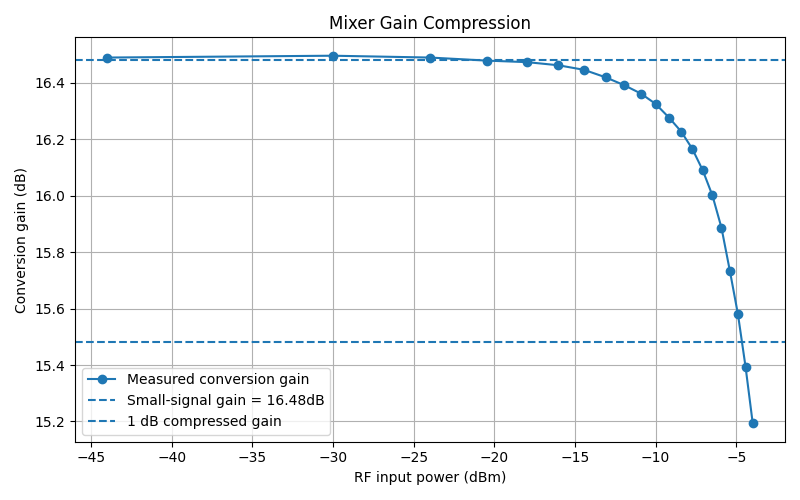

## Overview

This block implements a double-balanced active Gilbert-cell mixer for RF downconversion. It translates a differential RF input to an intermediate-frequency (IF) output by multiplying the RF signal with differential quadrature local oscillator (LO) signals, while providing conversion gain and suppressing even-order distortion and LO/RF feedthrough through its balanced architecture.

## Simulation Results

### Test Conditions
| Parameter | Value |
|-----------|------:|
| VDD | 3.3 V |
| RF Frequency | 100 MHz |
| LO Frequency | 75 MHz |
| IF Frequency | 25 MHz |
| RF Input | Differential |
| LO Input | Differential outputs of LO divider |
| Load Resistance | 6.8 kOhm |
| Tail Current | 500 µA |

### Performance

| Metric | Value |
|--------|------:|
| Conversion Gain | 16.5 dB |
| Core Power | 1.65 mW |
| Input-Referred 1 dB Compression (P1dB) | -4.65 dBm |
| IIP3 (Point-wise Average) | 4.3 dBm |
| IIP3 (Linear Fit) | -2.5 dBm |

## Linearity
All reported input powers (dBm), IIP3, and P1dB are referenced to an equivalent 50 Ohm source impedance for comparison with standard RF mixer specifications.

### Third-Order Intercept (IIP3)

[`notebooks/iip3_analysis.ipynb`](../../notebooks/iip3_analysis.ipynb)

The mixer was characterized using a two-tone test. IIP3 was extracted using two methods:
1. Point-wise calculation at each input power level within the linear region.
2. Linear regression of the fundamental and IM3 responses, with the intercept taken as the IIP3.
The point-wise method captures the local behavior of the circuit, while the fitted method provides a single representative value that is less sensitive to simulation noise, but assumes a 

#### Point-wise IIP3

  

#### Linear-fit IIP3

  

### 1 dB Compression Point

[`notebooks/p1db_analysis.ipynb`](../../notebooks/p1db_analysis.ipynb)

The conversion gain was swept versus input power to determine the input-referred 1 dB compression point (P1dB).

  

---

## Design Notes

- Tail current programmability has been removed from the mixer.
- The load resistance has been updated to the final design value.
- Conversion gain is fixed by the current bias and load resistance.
- Linearity has been characterized using both IIP3 and P1dB simulations.
